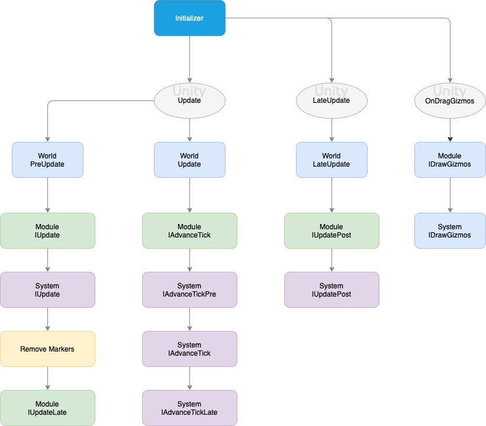

# Classes [](/../../#glossary)

#### Entities
[How to create an entity](Manual-CreatingEntities.md)

Entities are containers with **ID** and **Generation**.<br>
**ID** - unique entity identifier in the world.<br>
**Generation** - unique entity generation identifier, increase when entity creates from the pool.<br>
**GetVersion()** - method to return unique version of the entity, increase when entity changed.
<br>
<br>

#### Components (```IComponent```, ```ICopyable<>```, etc.)
[How to create a component](Manual-CreatingComponents.md)

Components are storing data. In ME.ECS there are 2 component types: IStructCopyable<> and IStructComponent.
IStructCopyable<> could be stored only once. it could store any types (including managed data) and must implement CopyFrom and OnRecycle methods.
IStructComponent could store just simple types or StackArray.
<br>
<br>

#### Systems (```ISystem```)
[How to create a system](Manual-CreatingSystems.md)

Systems do visual update at the end of the frame and on the ending of every tick.
<br>
<br>

#### Features (```Feature```)
[How to create a feature](Manual-CreatingFeature.md)

Features are introduced for grouping systems and modules into one block. Features are ScriptableObjects and could be ordered in Initializer on your scene
<br>
<br>

#### Modules (```IModule```)
[How to create a module](Manual-CreatingModules.md)

Modules do visual update on the beginning of the frame and on the beginning of every tick. Here you can get controller input and create some markers.
<br>
<br>

#### Markers (```IMarker```)
[How to create a marker](Manual-CreatingMarkers.md)

Markers needed to implement Controller/UI events or something that doesn't exist in game state.

<br>
<br>

## Interfaces

| Type | Description |
| ----- | ----- |
| ISystem | Default System behaviour. |
| IModule | Default Module behaviour. |
| IAdvanceTick | Use this interface in System or Module to get an update every tick. |
| IAdvanceTickPre | Use this interface in System to get an update every tick before IAdvanceTick. |
| IAdvanceTickPost | Use this interface in System to get an update every tick after IAdvanceTick. |
| ISystemFilter | Use this interface in System to get an iteration through the filter. |
| IAdvanceTickStep | Use this interface in System to get an update every X tick. |
| IUpdate | Use this interface in System or Module to get an update every frame in World::Update. |
| IUpdateLate | Use this interface in System to get an update every frame after IUpdate in World::Update. |
| IUpdatePost | Use this interface in System to get an update every frame in World::LateUpdate. |

<br>
<br>

## Flow



[](/../../#glossary)
