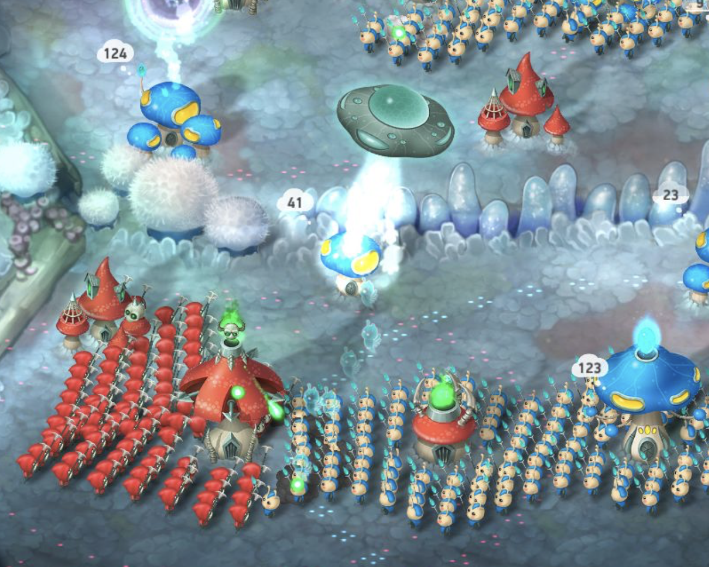
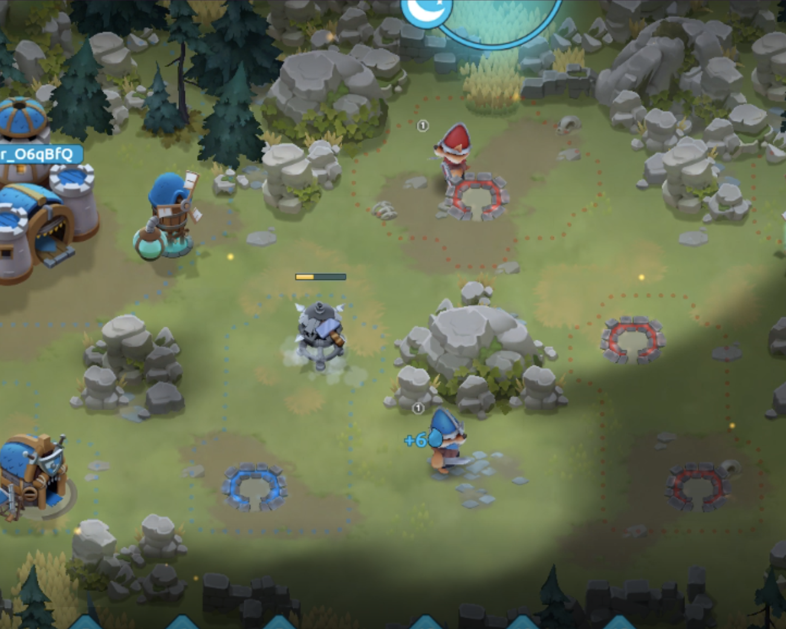
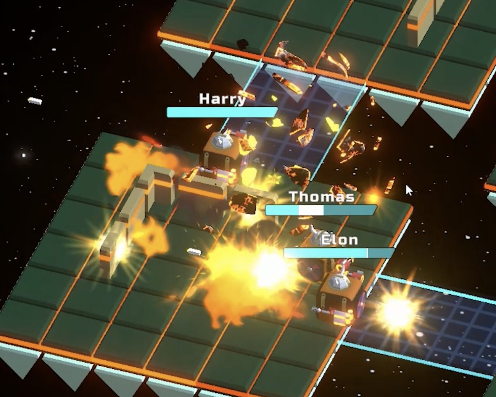

# ME.ECS

<a href="https://github.com/chromealex/ecs"></a>

<div><h4>ME.ECS - it's ECS implementation for Unity Engine with full state automatic rollbacks. In general ME.ECS could be used for multiplayer real-time strategy games (or any rudp/tcp-based) because of Network support out of the box with automatic rollbacks. You can set up tick time for your game and ME.ECS will store your state and automatically sync game instances using minimum traffic (just user RPC calls, no full game sync required).</h4></div>

[](https://github.com/chromealex/ecs/blob/master/LICENSE)
<a href="https://github.com/chromealex/ecs"></a>
<a href="https://github.com/chromealex/ecs"></a>
[](https://discord.gg/SxJJPPNsSf)


## Installation

> **Warning**
> This repository not always contains actual submodule, so you should check the latest changes in [submodule](https://github.com/chromealex/ecs-submodule)

<details>

<summary><h4>Using submodule</h4></summary>  

1. Download or add as a submodule this repository https://github.com/chromealex/ecs-submodule.
2. Create an empty file called ```csc.gen.rsp``` inside Assets folder. Your file should have the path ```Assets/csc.gen.rsp```.
3. Add packages (see [Package Dependencies](#package-dependencies) section).
4. Be sure your submodule folder has a name ```Assets/ecs-submodule``` or ```Assets/ECS-submodule```.
5. You are ready to [Initialize Project](Docs/VideoTutorials.md).

</details><details>

<summary><h4>Using Unity Package Manager</h4></summary>

1. Create an empty file called ```csc.gen.rsp``` inside Assets folder. Your file should have the path ```Assets/csc.gen.rsp```.
2. Open ```Packages/manifest.json``` file.
3. Add ME.ECS to your dependencies section:
```
{
  "dependencies": {
    [HERE ARE OTHER PACKAGES]
    "com.me.ecs": "https://github.com/chromealex/ecs-submodule.git"
  }
}
```
4. You are ready to [Initialize Project](Docs/VideoTutorials.md).

</details>

### Package Dependencies

``` 
    "com.unity.collections": "1.2.3",
    "com.unity.ui": "1.0.0-preview.18",
    "com.unity.addressables": "1.19.9",
    "com.unity.burst": "1.6.5",
    "com.unity.mathematics": "1.2.6",
    "com.unity.localization": "1.0.5",
    "com.unity.profiling.core": "1.0.0"
```

## Example Repository
<div>https://github.com/Oleg-Grim/Pong-Out</div>
<div>Pong Out - a classic pong game with fully functioning multiplayer made with ME.ECS</div>

## Submodule Repository
https://github.com/chromealex/ecs-submodule

## FAQ
[FAQ](Docs/FAQ.md)

## Glossary
| Link | Description |
| ------ | ----- |
| [Video Tutorials](Docs/VideoTutorials.md) | Here are some links to youtube channel which shows how to use some features |
| [Classes](Docs/Manual-Classes.md) | All classes and structures used in ME.ECS |
| [Memory Allocator](Docs/MemoryAllocator.md) | How to use memory allocator |
| [Deterministic Operations](Docs/Manual-Deterministic.md) | Deterministic Operations like Random and GetHashCode in collections |
| [Burst](Docs/Manual-Burst.md) | How to use burst |
| [World Operations](Docs/World-Operations.md) | How to operate the world |
| [Default Modules](Docs/DefaultModules.md) | Describe default modules included in ME.ECS by default |
| [Create World](Docs/Manual-CreatingWorld.md) | Describe how to create new world and set up your empty project |
| [Create Feature](Docs/Manual-CreatingFeature.md) | How to create new feature |
| [Create System](Docs/Manual-CreatingSystems.md) | How to create new system |
| [Create Module](Docs/Manual-CreatingModules.md) | How to create new module |
| [Create Entity](Docs/Manual-CreatingEntities.md) | How to create new entity |
| [Create Component](Docs/Manual-CreatingComponents.md) | How to create new component |
| [Create Filter](Docs/CreatingFilters-Archetypes.md) | How to create new filter |
| [Create Marker](Docs/Manual-CreatingMarkers.md) | How to create new marker |
| [Create Timers](Docs/Manual-Timers.md) | How to create timers |
| [Create Views](Docs/Manual-CreatingViews.md) | How to register prefab in ME.ECS |
| [Send User Input](Docs/Manual-SendingUserInputToWorld.md) | How to send user inputs to systems |
| [Send UI Events](Docs/Manual-SendingUIEventsToWorld.md) | How to send events from UI to systems |
| [Receive User Input](Docs/Manual-ReceivingUserInputInWorld.md) | How to receive markers in systems |
| [Send and Receive RPC Calls](Docs/Manual-SendingAndReceivingRPCCalls.md) | How to register object in **NetworkModule**, send and receive RPC packages |
| [Defines](Docs/Defines.md) | Define usage |
| [Data Configs](Docs/DataConfig-Readme.md) | How to create and use data configs |
| [Global Events](Docs/GlobalEvents-Readme.md) | How to create and use global events |
| [Code Generators](Docs/CodeGenerators.md) | Code Generators usage |

## ME.ECS Addons

| <h3>Pathfinding</h3> |
| ------ |
| [](https://github.com/chromealex/me.ecs-pathfinding/blob/master/LICENSE) <a href="https://github.com/chromealex/me.ecs-pathfinding"></a><br>Pathfinding implementation: AStar, FlowField, NavMesh<br>https://github.com/chromealex/me.ecs-pathfinding |
|&nbsp;&nbsp;&nbsp;&nbsp;&nbsp;&nbsp;&nbsp;&nbsp;&nbsp;&nbsp;&nbsp;&nbsp;&nbsp;&nbsp;&nbsp;&nbsp;&nbsp;&nbsp;&nbsp;&nbsp;&nbsp;&nbsp;&nbsp;&nbsp;&nbsp;&nbsp;&nbsp;&nbsp;&nbsp;&nbsp;&nbsp;&nbsp;&nbsp;&nbsp;&nbsp;&nbsp;&nbsp;&nbsp;&nbsp;&nbsp;&nbsp;&nbsp;&nbsp;&nbsp;&nbsp;&nbsp;&nbsp;&nbsp;&nbsp;&nbsp;&nbsp;&nbsp;&nbsp;&nbsp;&nbsp;&nbsp;&nbsp;&nbsp;&nbsp;&nbsp;&nbsp;&nbsp;&nbsp;&nbsp;&nbsp;&nbsp;&nbsp;&nbsp;&nbsp;&nbsp;&nbsp;&nbsp;&nbsp;&nbsp;&nbsp;&nbsp;&nbsp;&nbsp;&nbsp;&nbsp;&nbsp;&nbsp;&nbsp;&nbsp;&nbsp;&nbsp;&nbsp;&nbsp;&nbsp;&nbsp;&nbsp;&nbsp;&nbsp;&nbsp;&nbsp;&nbsp;&nbsp;&nbsp;&nbsp;&nbsp;&nbsp;&nbsp;&nbsp;&nbsp;&nbsp;&nbsp;&nbsp;&nbsp;&nbsp;&nbsp;&nbsp;|

| <h3>Physics</h3> |
| ------ |
| [](https://github.com/chromealex/me.ecs-physics/blob/main/LICENSE) <a href="https://github.com/chromealex/me.ecs-physics"></a><br>Unity Physics port (DOTS) with fixed-point math<br>https://github.com/chromealex/me.ecs-physics |
|&nbsp;&nbsp;&nbsp;&nbsp;&nbsp;&nbsp;&nbsp;&nbsp;&nbsp;&nbsp;&nbsp;&nbsp;&nbsp;&nbsp;&nbsp;&nbsp;&nbsp;&nbsp;&nbsp;&nbsp;&nbsp;&nbsp;&nbsp;&nbsp;&nbsp;&nbsp;&nbsp;&nbsp;&nbsp;&nbsp;&nbsp;&nbsp;&nbsp;&nbsp;&nbsp;&nbsp;&nbsp;&nbsp;&nbsp;&nbsp;&nbsp;&nbsp;&nbsp;&nbsp;&nbsp;&nbsp;&nbsp;&nbsp;&nbsp;&nbsp;&nbsp;&nbsp;&nbsp;&nbsp;&nbsp;&nbsp;&nbsp;&nbsp;&nbsp;&nbsp;&nbsp;&nbsp;&nbsp;&nbsp;&nbsp;&nbsp;&nbsp;&nbsp;&nbsp;&nbsp;&nbsp;&nbsp;&nbsp;&nbsp;&nbsp;&nbsp;&nbsp;&nbsp;&nbsp;&nbsp;&nbsp;&nbsp;&nbsp;&nbsp;&nbsp;&nbsp;&nbsp;&nbsp;&nbsp;&nbsp;&nbsp;&nbsp;&nbsp;&nbsp;&nbsp;&nbsp;&nbsp;&nbsp;&nbsp;&nbsp;&nbsp;&nbsp;&nbsp;&nbsp;&nbsp;&nbsp;&nbsp;&nbsp;&nbsp;&nbsp;&nbsp;|

| <h3>Input</h3> |
| ------ |
| [](https://github.com/chromealex/me.ecs-input/blob/main/LICENSE) <a href="https://github.com/chromealex/me.ecs-input"></a><br>Input implementation for mouse/touch<br>https://github.com/chromealex/me.ecs-input |
|&nbsp;&nbsp;&nbsp;&nbsp;&nbsp;&nbsp;&nbsp;&nbsp;&nbsp;&nbsp;&nbsp;&nbsp;&nbsp;&nbsp;&nbsp;&nbsp;&nbsp;&nbsp;&nbsp;&nbsp;&nbsp;&nbsp;&nbsp;&nbsp;&nbsp;&nbsp;&nbsp;&nbsp;&nbsp;&nbsp;&nbsp;&nbsp;&nbsp;&nbsp;&nbsp;&nbsp;&nbsp;&nbsp;&nbsp;&nbsp;&nbsp;&nbsp;&nbsp;&nbsp;&nbsp;&nbsp;&nbsp;&nbsp;&nbsp;&nbsp;&nbsp;&nbsp;&nbsp;&nbsp;&nbsp;&nbsp;&nbsp;&nbsp;&nbsp;&nbsp;&nbsp;&nbsp;&nbsp;&nbsp;&nbsp;&nbsp;&nbsp;&nbsp;&nbsp;&nbsp;&nbsp;&nbsp;&nbsp;&nbsp;&nbsp;&nbsp;&nbsp;&nbsp;&nbsp;&nbsp;&nbsp;&nbsp;&nbsp;&nbsp;&nbsp;&nbsp;&nbsp;&nbsp;&nbsp;&nbsp;&nbsp;&nbsp;&nbsp;&nbsp;&nbsp;&nbsp;&nbsp;&nbsp;&nbsp;&nbsp;&nbsp;&nbsp;&nbsp;&nbsp;&nbsp;&nbsp;&nbsp;&nbsp;&nbsp;&nbsp;&nbsp;|

| <h3>Destroy</h3> |
| ------ |
| [](https://github.com/chromealex/me.ecs-destroy/blob/master/LICENSE) <a href="https://github.com/chromealex/me.ecs-destroy"></a><br>Additional API to destroy entities by the time<br>https://github.com/chromealex/me.ecs-destroy |
|&nbsp;&nbsp;&nbsp;&nbsp;&nbsp;&nbsp;&nbsp;&nbsp;&nbsp;&nbsp;&nbsp;&nbsp;&nbsp;&nbsp;&nbsp;&nbsp;&nbsp;&nbsp;&nbsp;&nbsp;&nbsp;&nbsp;&nbsp;&nbsp;&nbsp;&nbsp;&nbsp;&nbsp;&nbsp;&nbsp;&nbsp;&nbsp;&nbsp;&nbsp;&nbsp;&nbsp;&nbsp;&nbsp;&nbsp;&nbsp;&nbsp;&nbsp;&nbsp;&nbsp;&nbsp;&nbsp;&nbsp;&nbsp;&nbsp;&nbsp;&nbsp;&nbsp;&nbsp;&nbsp;&nbsp;&nbsp;&nbsp;&nbsp;&nbsp;&nbsp;&nbsp;&nbsp;&nbsp;&nbsp;&nbsp;&nbsp;&nbsp;&nbsp;&nbsp;&nbsp;&nbsp;&nbsp;&nbsp;&nbsp;&nbsp;&nbsp;&nbsp;&nbsp;&nbsp;&nbsp;&nbsp;&nbsp;&nbsp;&nbsp;&nbsp;&nbsp;&nbsp;&nbsp;&nbsp;&nbsp;&nbsp;&nbsp;&nbsp;&nbsp;&nbsp;&nbsp;&nbsp;&nbsp;&nbsp;&nbsp;&nbsp;&nbsp;&nbsp;&nbsp;&nbsp;&nbsp;&nbsp;&nbsp;&nbsp;&nbsp;&nbsp;|

| <h3>GOAP</h3> |
| ------ |
| [](https://github.com/chromealex/me.ecs-goap/blob/master/LICENSE) <a href="https://github.com/chromealex/me.ecs-goap"></a><br>GOAP implementation<br>https://github.com/chromealex/me.ecs-goap |
|&nbsp;&nbsp;&nbsp;&nbsp;&nbsp;&nbsp;&nbsp;&nbsp;&nbsp;&nbsp;&nbsp;&nbsp;&nbsp;&nbsp;&nbsp;&nbsp;&nbsp;&nbsp;&nbsp;&nbsp;&nbsp;&nbsp;&nbsp;&nbsp;&nbsp;&nbsp;&nbsp;&nbsp;&nbsp;&nbsp;&nbsp;&nbsp;&nbsp;&nbsp;&nbsp;&nbsp;&nbsp;&nbsp;&nbsp;&nbsp;&nbsp;&nbsp;&nbsp;&nbsp;&nbsp;&nbsp;&nbsp;&nbsp;&nbsp;&nbsp;&nbsp;&nbsp;&nbsp;&nbsp;&nbsp;&nbsp;&nbsp;&nbsp;&nbsp;&nbsp;&nbsp;&nbsp;&nbsp;&nbsp;&nbsp;&nbsp;&nbsp;&nbsp;&nbsp;&nbsp;&nbsp;&nbsp;&nbsp;&nbsp;&nbsp;&nbsp;&nbsp;&nbsp;&nbsp;&nbsp;&nbsp;&nbsp;&nbsp;&nbsp;&nbsp;&nbsp;&nbsp;&nbsp;&nbsp;&nbsp;&nbsp;&nbsp;&nbsp;&nbsp;&nbsp;&nbsp;&nbsp;&nbsp;&nbsp;&nbsp;&nbsp;&nbsp;&nbsp;&nbsp;&nbsp;&nbsp;&nbsp;&nbsp;&nbsp;&nbsp;&nbsp;|

| <h3>Collections: DataObject</h3> |
| ------ |
| [](https://github.com/chromealex/me.ecs-collections-dataobject/blob/master/LICENSE) <a href="https://github.com/chromealex/me.ecs-collections-dataobject"></a><br>DataObject collections<br>https://github.com/chromealex/me.ecs-collections-dataobject |
|&nbsp;&nbsp;&nbsp;&nbsp;&nbsp;&nbsp;&nbsp;&nbsp;&nbsp;&nbsp;&nbsp;&nbsp;&nbsp;&nbsp;&nbsp;&nbsp;&nbsp;&nbsp;&nbsp;&nbsp;&nbsp;&nbsp;&nbsp;&nbsp;&nbsp;&nbsp;&nbsp;&nbsp;&nbsp;&nbsp;&nbsp;&nbsp;&nbsp;&nbsp;&nbsp;&nbsp;&nbsp;&nbsp;&nbsp;&nbsp;&nbsp;&nbsp;&nbsp;&nbsp;&nbsp;&nbsp;&nbsp;&nbsp;&nbsp;&nbsp;&nbsp;&nbsp;&nbsp;&nbsp;&nbsp;&nbsp;&nbsp;&nbsp;&nbsp;&nbsp;&nbsp;&nbsp;&nbsp;&nbsp;&nbsp;&nbsp;&nbsp;&nbsp;&nbsp;&nbsp;&nbsp;&nbsp;&nbsp;&nbsp;&nbsp;&nbsp;&nbsp;&nbsp;&nbsp;&nbsp;&nbsp;&nbsp;&nbsp;&nbsp;&nbsp;&nbsp;&nbsp;&nbsp;&nbsp;&nbsp;&nbsp;&nbsp;&nbsp;&nbsp;&nbsp;&nbsp;&nbsp;&nbsp;&nbsp;&nbsp;&nbsp;&nbsp;&nbsp;&nbsp;&nbsp;&nbsp;&nbsp;&nbsp;&nbsp;&nbsp;&nbsp;|

| <h3>Collections: Intrusive</h3> |
| ------ |
| [](https://github.com/chromealex/me.ecs-collections-intrusive/blob/master/LICENSE) <a href="https://github.com/chromealex/me.ecs-collections-intrusive"></a><br>Intrusive collections<br>https://github.com/chromealex/me.ecs-collections-intrusive |
|&nbsp;&nbsp;&nbsp;&nbsp;&nbsp;&nbsp;&nbsp;&nbsp;&nbsp;&nbsp;&nbsp;&nbsp;&nbsp;&nbsp;&nbsp;&nbsp;&nbsp;&nbsp;&nbsp;&nbsp;&nbsp;&nbsp;&nbsp;&nbsp;&nbsp;&nbsp;&nbsp;&nbsp;&nbsp;&nbsp;&nbsp;&nbsp;&nbsp;&nbsp;&nbsp;&nbsp;&nbsp;&nbsp;&nbsp;&nbsp;&nbsp;&nbsp;&nbsp;&nbsp;&nbsp;&nbsp;&nbsp;&nbsp;&nbsp;&nbsp;&nbsp;&nbsp;&nbsp;&nbsp;&nbsp;&nbsp;&nbsp;&nbsp;&nbsp;&nbsp;&nbsp;&nbsp;&nbsp;&nbsp;&nbsp;&nbsp;&nbsp;&nbsp;&nbsp;&nbsp;&nbsp;&nbsp;&nbsp;&nbsp;&nbsp;&nbsp;&nbsp;&nbsp;&nbsp;&nbsp;&nbsp;&nbsp;&nbsp;&nbsp;&nbsp;&nbsp;&nbsp;&nbsp;&nbsp;&nbsp;&nbsp;&nbsp;&nbsp;&nbsp;&nbsp;&nbsp;&nbsp;&nbsp;&nbsp;&nbsp;&nbsp;&nbsp;&nbsp;&nbsp;&nbsp;&nbsp;&nbsp;&nbsp;&nbsp;&nbsp;&nbsp;|

| <h3>Data Config Generator</h3> |
| ------ |
| [](https://github.com/chromealex/me.ecs-dataconfiggenerator/blob/master/LICENSE) <a href="https://github.com/chromealex/me.ecs-dataconfiggenerator"></a><br>Data Config Generator for Google Spreadsheets<br>https://github.com/chromealex/me.ecs-dataconfiggenerator |
|&nbsp;&nbsp;&nbsp;&nbsp;&nbsp;&nbsp;&nbsp;&nbsp;&nbsp;&nbsp;&nbsp;&nbsp;&nbsp;&nbsp;&nbsp;&nbsp;&nbsp;&nbsp;&nbsp;&nbsp;&nbsp;&nbsp;&nbsp;&nbsp;&nbsp;&nbsp;&nbsp;&nbsp;&nbsp;&nbsp;&nbsp;&nbsp;&nbsp;&nbsp;&nbsp;&nbsp;&nbsp;&nbsp;&nbsp;&nbsp;&nbsp;&nbsp;&nbsp;&nbsp;&nbsp;&nbsp;&nbsp;&nbsp;&nbsp;&nbsp;&nbsp;&nbsp;&nbsp;&nbsp;&nbsp;&nbsp;&nbsp;&nbsp;&nbsp;&nbsp;&nbsp;&nbsp;&nbsp;&nbsp;&nbsp;&nbsp;&nbsp;&nbsp;&nbsp;&nbsp;&nbsp;&nbsp;&nbsp;&nbsp;&nbsp;&nbsp;&nbsp;&nbsp;&nbsp;&nbsp;&nbsp;&nbsp;&nbsp;&nbsp;&nbsp;&nbsp;&nbsp;&nbsp;&nbsp;&nbsp;&nbsp;&nbsp;&nbsp;&nbsp;&nbsp;&nbsp;&nbsp;&nbsp;&nbsp;&nbsp;&nbsp;&nbsp;&nbsp;&nbsp;&nbsp;&nbsp;&nbsp;&nbsp;&nbsp;&nbsp;&nbsp;|

| <h3>Addressable Views</h3> |
| ------ |
| [](https://github.com/chromealex/me.ecs-viewaddressables/blob/master/LICENSE) <a href="https://github.com/chromealex/me.ecs-viewaddressables"></a><br>Additional API to be able load addressables<br>https://github.com/chromealex/me.ecs-viewaddressables |
|&nbsp;&nbsp;&nbsp;&nbsp;&nbsp;&nbsp;&nbsp;&nbsp;&nbsp;&nbsp;&nbsp;&nbsp;&nbsp;&nbsp;&nbsp;&nbsp;&nbsp;&nbsp;&nbsp;&nbsp;&nbsp;&nbsp;&nbsp;&nbsp;&nbsp;&nbsp;&nbsp;&nbsp;&nbsp;&nbsp;&nbsp;&nbsp;&nbsp;&nbsp;&nbsp;&nbsp;&nbsp;&nbsp;&nbsp;&nbsp;&nbsp;&nbsp;&nbsp;&nbsp;&nbsp;&nbsp;&nbsp;&nbsp;&nbsp;&nbsp;&nbsp;&nbsp;&nbsp;&nbsp;&nbsp;&nbsp;&nbsp;&nbsp;&nbsp;&nbsp;&nbsp;&nbsp;&nbsp;&nbsp;&nbsp;&nbsp;&nbsp;&nbsp;&nbsp;&nbsp;&nbsp;&nbsp;&nbsp;&nbsp;&nbsp;&nbsp;&nbsp;&nbsp;&nbsp;&nbsp;&nbsp;&nbsp;&nbsp;&nbsp;&nbsp;&nbsp;&nbsp;&nbsp;&nbsp;&nbsp;&nbsp;&nbsp;&nbsp;&nbsp;&nbsp;&nbsp;&nbsp;&nbsp;&nbsp;&nbsp;&nbsp;&nbsp;&nbsp;&nbsp;&nbsp;&nbsp;&nbsp;&nbsp;&nbsp;&nbsp;&nbsp;|

## Addons
| Link | Description |
| ------ | ----- |
| [Addons](https://github.com/chromealex/ecs-submodule/tree/master/Addons) | Here are addon packages for ME.ECS |
| [Serializer Package](https://github.com/chromealex/ecs-submodule/tree/master/Runtime/Addons/ME.Serializer) | Here is Serializer Package readme |
| [Input](https://github.com/chromealex/me.ecs-input) | Input Implementation for touch/mouse controls |
| [Destroy](https://github.com/chromealex/me.ecs-destroy) | Destroy Feature to control entities lifetime |
| [Pathfinding](https://github.com/chromealex/me.ecs-pathfinding) | Here is Pathfinding Package readme |
| [GOAP](https://github.com/chromealex/me.ecs-goap) | GOAP Implementation |
| [Physics](https://github.com/chromealex/me.ecs-physics) | Unity Physics port with fixed-point math |
| [Data Config Generator](https://github.com/chromealex/ecs-submodule/tree/master/Addons/DataConfigGenerator) | Data Config Generator with Google Spreadsheets |

## Discord
https://discord.gg/SxJJPPNsSf

## Contact Me
<a href="https://t.me/chromealex"></a></br>
<a href="mailto:chrome.alex@gmail.com"></a></br>
<a href="https://www.facebook.com/chrome.alex"></a></br>

## Inspired by
> <br>
> <b>Mushroom Wars 2</b><br>
> Steam, iOS, Android, Switch, XBOXOne, PS4

## Projects
> <br>
> <b>Wild Wars</b><br>
> Mobile (iOS/Android)

> <br>
> <b>Qubix Infinity</b><br>
> WebGL

> <br>
> <b>Unreleased Project #1</b><br>
> Mobile (iOS/Android)
